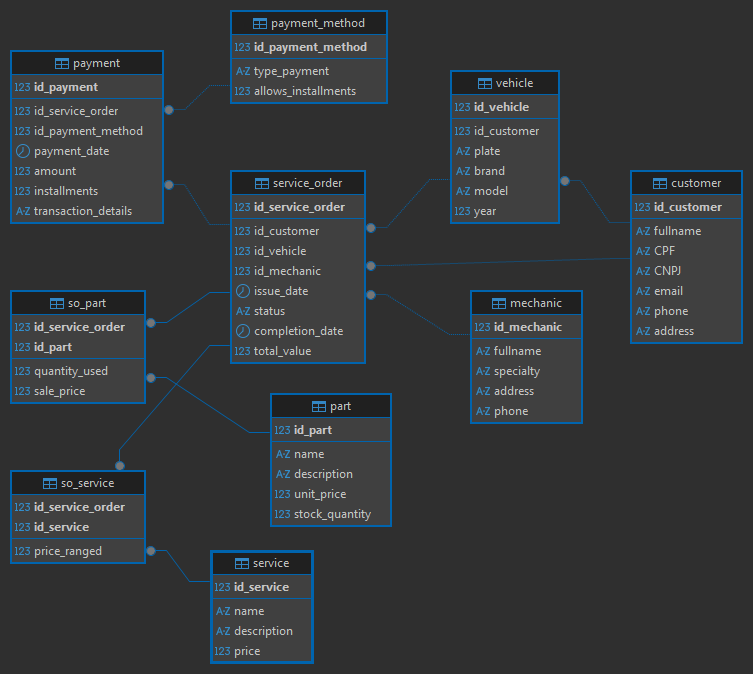

# Análise de Desempenho e Finanças com SQL: Gestão de Oficina Mecânica

O foco deste projeto é a **demonstração prática de como a análise de dados pode transformar a gestão de um negócio de serviços.** Desenvolvi **esta análise** simulando um ambiente de dados transacionais reais, onde o valor principal está na entrega de **ferramentas analíticas essenciais** para o gestor da oficina. O trabalho permite quantificar o risco financeiro através do **saldo devedor**, identificar e recompensar os **mecânicos mais rentáveis**, e **otimizar** o tempo médio de conclusão dos serviços.

---

## Tabela de Conteúdos
* [Visão geral do Projeto](#visão-geral-do-projeto)
* [Diagrama Entidade-Relacionamento (DER)](#diagrama-entidade-relacionamento-der)
* [Validação Técnica](#validação-técnica)
* [Ferramentas e Tecnologias](#ferramentas-e-tecnologias)
* [Guia de execução](#guia-de-execução)
* [Análises e Insights (Queries)](#análises-e-insights-queries)

---

## Visão geral do Projeto

O controle de uma oficina depende da precisão dos dados sobre produtividade e finanças. **Desenvolvi esta arquitetura de dados para dar aos gestores uma visão clara e imediata sobre as alavancas do negócio:**

* **Eficiência Operacional:** Rastreamento do tempo de serviço e avaliação de produtividade por mecânico.
* **Controle de Margem:** Análise da rentabilidade real de peças vendidas vs. serviços prestados.
* **Risco Financeiro:** Identificação e quantificação do saldo devedor para ações de cobrança.

---

## Diagrama Entidade-Relacionamento (DER)

O *schema* foi desenhado para garantir integridade referencial e otimizar consultas sobre o fluxo de trabalho da oficina.

**Modelagem de Destaque:**
* **Centralização da OS:** A tabela `service_order` é o eixo central, **vinculando** `customer`, `vehicle` e `mechanic` de forma eficiente.
* **Relação N:N:** Uso das tabelas associativas `so_service` e `so_part` para permitir que uma **ordem de serviço** consuma múltiplos itens (peças e serviços), **essencial** para o cálculo de custos e margem de lucro.

---

## Validação Técnica 

Demonstrado pela capacidade de segregar e executar corretamente o ciclo de vida do banco de dados, utilizando os seguintes *scripts*:

| Arquivo | Habilidade Focada | Descrição do Conteúdo |
| :--- | :--- | :--- |
| `sql/schema.sql` | **DDL** (Criação da Estrutura) | Contém a definição completa do *schema*, **incluindo a integridade referencial** (chaves estrangeiras). |
| `sql/sample_data.sql` | **DML** (Manipulação de Dados) | Inserção de um conjunto de dados de teste (clientes, ordem de serviço, pagamentos) para simulação de ambiente transacional. |
| `sql/analysis_queries.sql` | **DQL** (Consulta e Análise) | Contém consultas estratégicas prontas para gerar *insights* de gestão. |

---

## Ferramentas e Habilidades

* **Sistema de Gerenciamento de Banco de Dados:** MySQL
* **Linguagem:** SQL
* **Cliente de Banco de Dados:** DBeaver

--- 

## Guia de execução

Você pode recriar o ambiente e validar a análise em seu computador.

1.  **Clone o Repositório.**
2.  **Execute os *scripts* na ordem correta** (`schema.sql` $\to$ `sample_data.sql` $\to$ `analysis_queries.sql`).
3.  Visualize os resultados no seu cliente SQL.

---

## Análises e Insights (Queries)

O arquivo ´analysis_queries.sql´ é a prova de minha capacidade analítica. Ele contém consultas otimizadas para responder diretamente às questões de gestão mais críticas, agrupadas por área de foco:

### Performance de Equipe e Eficiência Operacional

**Produtividade do Mecânico:** Qual mecânico gerou a maior receita bruta no período, e qual é o volume de ordens canceladas por profissional.

**Tempo de Serviço:** Qual o tempo médio de conclusão  de cada tipo de serviço (em dias), essencial para otimizar o agendamento.

### Controle Financeiro e Risco

**Saúde do Fluxo de Caixa:** Qual é o saldo devedor atual e quais clientes estão inadimplentes.

**Rentabilidade do Estoque:** Comparativo do custo total das peças vendidas versus a receita gerada por elas.

**Comportamento de Pagamento:** Análise da forma de pagamento mais utilizada (volume e valor) e a média de parcelamento no cartão.

### Perfil do Cliente e Crescimento

**Clientes de Alto Valor:** Quais são os 5 clientes que geraram a maior receita total para a oficina.

**Oportunidade de Mercado:** Quantos clientes possuem mais de um veículo registrado e qual o seu valor médio de ordem de serviço, indicando potencial de fidelização.

**Frequência de Veículos:** Qual é a marca e modelo de veículo mais frequente na oficina.
